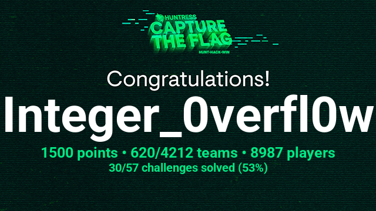

  

# [__Challenges__](#challenges)
| Category      | Name                                                                    | Objective         | Difficulty [⭐⭐⭐⭐⭐] |
|---------------|-------------------------------------------------------------------------|--------------------------------------------------|-------------------------|
| **Warmup** | [BaseFFFF+1](huntress-ctf-2023/warmup/%5BWarmup%5D%20BaseFFFF%2B1) | Decrypt using BaseFFFF+1 | ⭐ |
| **Warmup** | [Book By Its Cover](huntress-ctf-2023/warmup/%5BWarmup%5D%20Book%20By%20Its%20Cover) | Find and change to the right file extension | ⭐ |
| **Warmup** | [Caesar Mirror](huntress-ctf-2023/warmup/%5BWarmup%5D%20Caesar%20Mirror) | Decrypt using Rot13, reverse and decrypt 2nd column using rot 13 | ⭐ |
| **Warmup** | [Chicken Wings](huntress-ctf-2023/warmup/%5BWarmup%5D%20Chicken%20Wings) | Decrypt using Wingdings | ⭐ |
| **Warmup** | [Comprezz](huntress-ctf-2023/warmup/%5BWarmup%5D%20Comprezz) | Find the right compression and uncompress the file | ⭐ |
| **Warmup** | [Dialtone](huntress-ctf-2023/warmup/%5BWarmup%5D%20Dialtone) | Decrypt using Dialtone and then use long to bytes converter | ⭐ |
| **Warmup** | [Layered Security](huntress-ctf-2023/warmup/%5BWarmup%5D%20Layered%20Security) | Uncheck the image layers | ⭐ |
| **Warmup** | [Notepad](huntress-ctf-2023/warmup/%5BWarmup%5D%20Notepad) | Use terminal concatinating commands or open via notepad | ⭐ |
| **Warmup** | [Query Code](huntress-ctf-2023/warmup/%5BWarmup%5D%20Query%20Code) | Find the correct file extension and then scan the QR code | ⭐ |
| **Warmup** | [Strings Cheese](huntress-ctf-2023/warmup/%5BWarmup%5D%20Strings%20Cheese) | Use strings command | ⭐ |
| **Steganography** | [Land Before Time](huntress-ctf-2023/steganography/%5BEasy%5D%20Land%20Before%20Time/README.md) | Extract the hidden text inside the image | ⭐⭐ |
| **OSINT** | [Where Am I?](huntress-ctf-2023/osint/%5BMedium%5D%20Where%20Am%20I) | Use basic osint tools to find the flag | ⭐⭐⭐ |
| **Miscellaneous** | [Welcome To The Park](huntress-ctf-2023/miscellaneous/%5BMedium%5D%20Welcome%20to%20The%20Park) | Find the flag hiding in the Mach-O files | ⭐⭐⭐ |
| **Miscellaneous** | [Babel](huntress-ctf-2023/miscellaneous/%5BMedium%5D%20Babel) | Deobfuscate and use cryptography techniques | ⭐⭐⭐ |
| **Miscellaneous** | [Rock, Paper, Psychic](huntress-ctf-2023/miscellaneous/%5BMedium%5D%20Rock%2C%20Paper%2C%20Psychic) | Use cutter or ghidra to understand the executable file | ⭐⭐⭐ |
| **Malware** | [BlackCat](huntress-ctf-2023/malware/%5BEasy%5D%20BlackCat) | Decrypt an encrypted file by finding the password | ⭐⭐ |
| **Malware** | [HumanTwo](huntress-ctf-2023/malware/%5BEasy%5D%20HumanTwo) |  analyze and identify a unique string pattern within a set of log files  | ⭐⭐ |
| **Malware** | [Snake Eater](huntress-ctf-2023/malware/%5BEasy%5D%20Snake%20Eater) | Basic dynamic malware analysis | ⭐⭐ |
| **Malware** | [VeeBeeEee](huntress-ctf-2023/malware/%5BEasy%5D%20VeeBeeEee) | Ivestigate a malware by decoding a suspicious file invoked with wscript | ⭐⭐ |
| **Malware** | [Hot Off The Press](huntress-ctf-2023/malware/%5BMedium%5D%20Hot%20Off%20The%20Press) | Extract and deobfuscate a PowerShell script embedded within a UHarc archive | ⭐⭐⭐ |
| **Malware** | [PHP Stager](huntress-ctf-2023/malware/%5BMedium%5D%20PHP%20Stager) | Not yet answered | ⭐⭐⭐ |
| **Malware** | [RAT](huntress-ctf-2023/malware/%5BMedium%5D%20RAT) | identify potential security threats in files by obtaining their hashes | ⭐⭐⭐ |
| **Malware** | [Zerion](huntress-ctf-2023/malware/%5BMedium%5D%20Zerion) | Deobfuscate the given data by utilizing different cyberchef techniques | ⭐⭐⭐ |
| **Malware** | [BlackCat II](huntress-ctf-2023/malware/%5BHard%5D%20BlackCat%20II) | Not yet answered | ⭐⭐⭐⭐ |
| **Forensics** | [Dumpster Fire](huntress-ctf-2023/forensics/%5BEasy%5D%20Dumpster%20Fire) | Not yet answered | ⭐⭐ |
| **Forensics** | [Opposable Thumbs](huntress-ctf-2023/forensics/%5BEasy%5D%20Opposable%20Thumbs) | Use thumbcacheviewer to view and analyze the given file | ⭐⭐ |
| **Forensics** | [Wimble](huntress-ctf-2023/forensics/%5BEasy%5D%20Wimble) | Not yet answered | ⭐⭐ |
| **Forensics** | [Rogue Inbox](huntress-ctf-2023/forensics/%5BMedium%5D%20Rogue%20Inbox) | Analyze the .csv file and find a pattern | ⭐⭐⭐ |
| **Forensics** | [Traffic](huntress-ctf-2023/forensics/%5BMedium%5D%20Traffic) | find the sketchy site within the log files | ⭐⭐⭐ |
| **Forensics** | [Texas Chainsaw Massacre Tokyo' Drift](huntress-ctf-2023/forensics/%5BHard%5D%20Texas%20Chainsaw%20Massacre'%20Tokyo%20Drift) | Not yet answered | ⭐⭐⭐⭐ |
---

  

