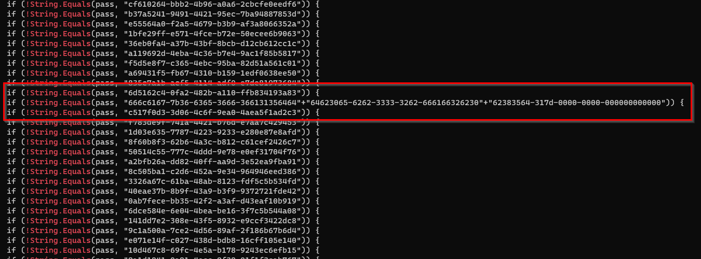
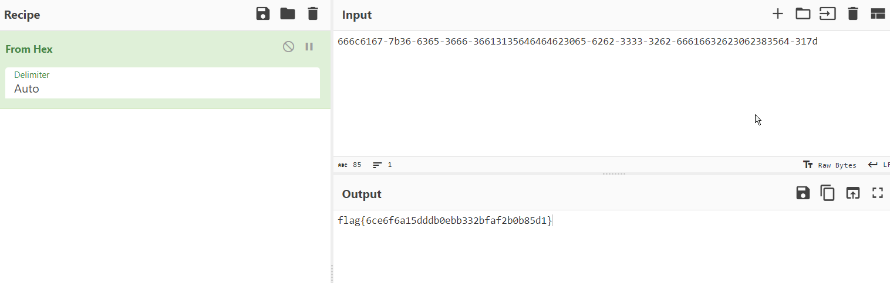

        **HumanTwo**

November 1st 2023

Prepared By: Capyhax

Challenge Author(s): @JohnHammond

Difficulty: Easy

Download: [Challenge](https://github.com/Maclteration/Huntress-CTF-2023/raw/main/huntress-ctf-2023/malware/%5BEasy%5D%20HumanTwo/human2.aspx_iocs.zip)

# Description
During the MOVEit Transfer exploitation, there were tons of "indicators of compromise" hashes available for the human2.aspx webshell! We collected a lot of them, but they all look very similar... except for very minor differences. Can you find an oddity?

**NOTE:** this challenge is based off of a real malware sample. Huntress had done their best to "defang" the code, but out of abudance of caution it is strongly encouraged you only analyze this inside of a virtual environment separate from any production devices.

## Flag

`flag{6ce6f6a15dddb0ebb332bfaf2b0b85d1}`

# Solution

1. Use `cat * > output.txt` to compile all the files into one text file

2. Open output.txt in notepad++ 

3. Analyze the output.txt, use `ctrl + f` and look for patterns

4. It is noticeable taht all of it is the same exept for the value of `!String.Equals`

5. Use `cat * | grep '!String.Equals'` 

6. we can see that `(!String.Equals(pass, "666c6167-7b36-6365-3666-366131356464"+"64623065-6262-3333-3262-666166326230"+"62383564-317d-0000-0000-000000000000"))` is the only one that has a long value

6. use cyberchef to decode from hex

