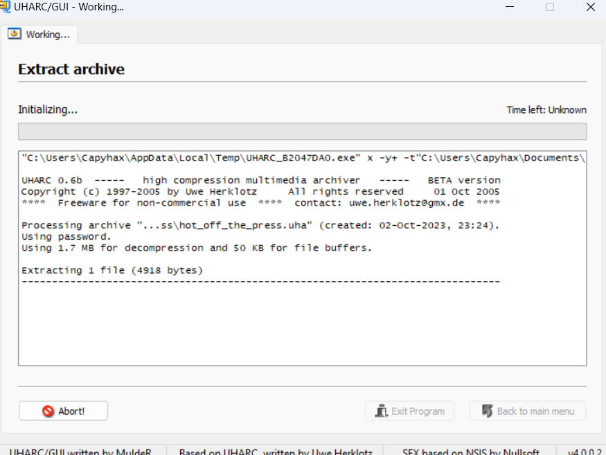

        <font size="10">**Hot Off The Press**</font>

November 1<sup>st</sup> 2023

Prepared By: Capyhax

Challenge Author(s): @JohnHammond

Difficulty: <font color=yellow>Medium</font>

Download: [Challenge](https://github.com/Maclteration/Huntress-CTF-2023/raw/main/huntress-ctf-2023/malware/%5BMedium%5D%20Hot%20Off%20The%20Press/hot_off_the_press.zip)

# Description

Oh wow, a malware analyst shared a sample that I read about in the news! But it looks like they put it in some weird kind of archive...? Anyway, the password should be infected as usual!

**NOTE:** this challenge is based off of a real malware sample. Huntress had done their best to "defang" the code, but out of abudance of caution it is strongly encouraged you only analyze this inside of a virtual environment separate from any production devices.

## Flag

`flag{dbfe5f755a898ce5f2088b0892850bf7}`

# Solution

1. Use `file` on `hot_off_the_press`

    ```
    hot_off_the_press: UHarc archive data
    ```

2. Change `hot_off_the_press` to `hot_off_the_press.uha`

3. Download uharc gui here
- https://www.softpedia.com/get/Compression-tools/UHARC-GUI-by-Brhack.shtml

4. Open uharc gui


5. Feed/insert `hot_off_the_press.uha` then input password `infected` as said in the description


6. Click extract files to get the .ps1 file


7. After the extraction, you will have a `.ps1` file


8. Use `cat` command on the `.ps1` file extracted using uharc gui


9. I deobfuscated the `.ps1` file but it still doesn't work so I asked gpt for questions

    ```
    ME: Explain .ps1 file

    GPT: In the provided PowerShell script, the {0} and {1} are placeholders used in a format string. In PowerShell, format strings allow you to create a string with placeholders that are later replaced by values. The placeholders are represented by {0}, {1}, {2}, and so on, and they are replaced by the corresponding values provided in subsequent arguments. The placeholders {0} and {1} are used within the format string to insert the values 'L' and 'E', respectively

    [...].FromBase64String(((''H4sI''+''AIeJ''+...+''AA=')-f''L'',''E''))) 
    ```

10. This is the cyberchef recipe I ended up with to deobfuscate and replace {0} and {1}

    ```
    Find_/_Replace({'option':'Simple string','string':'\'\'+\'\''},'',true,false,true,false)
    Find_/_Replace({'option':'Simple string','string':'{0}'},'L',true,false,true,false)
    Find_/_Replace({'option':'Simple string','string':'{1}'},'E',true,false,true,false)
    From_Base64('A-Za-z0-9+/=',true,false)
    ```

11. Cyberchef then detects that this is a gzip file so I saved it
 

12. Unzip gzip file and concatinate the file inside. The output appears to have a base64 encoded string


13. Decode from base64 and use URL decode to reveal the flag
    ```
    From_Base64('A-Za-z0-9+/=',true,false)
    URL_Decode()
    ```


