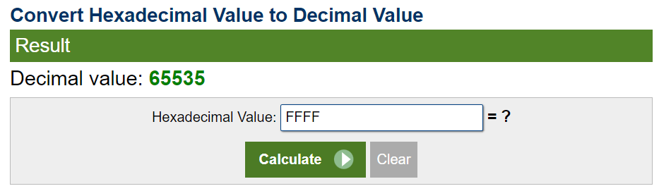

        **BaseFFFF+1**

November 1st 2023

Prepared By: Capyhax

Challenge Author(s): @JohnHammond

Difficulty: Warmup

Download: [Challenge](https://github.com/Maclteration/Huntress-CTF-2023/raw/main/huntress-ctf-2023/warmup/%5BWarmup%5D%20BaseFFFF+1/baseffff1.zip)

# Description

Maybe you already know about base64, but what if we took it up a notch?

 

## Flag

`flag{716abce880f09b7cdc7938eddf273648}`

# Solution

1. Search the meaning of BaseFFFF+1 and Convert

    

2. 65535 + 1 = 65536 
3. Decode The Message Using Base65536 
- https://www.better-converter.com/Encoders-Decoders/Base65536-Decode